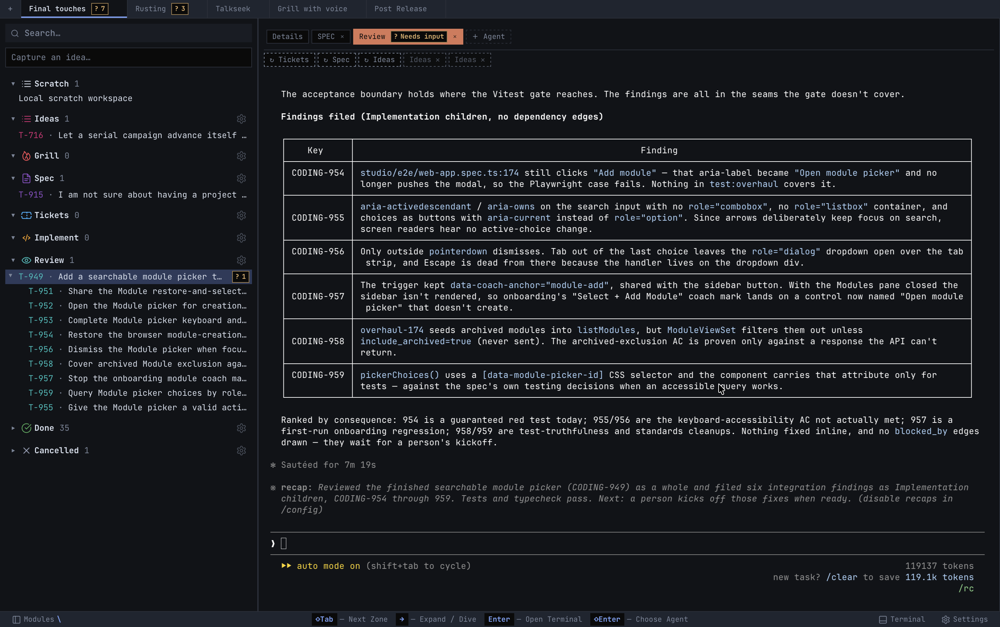
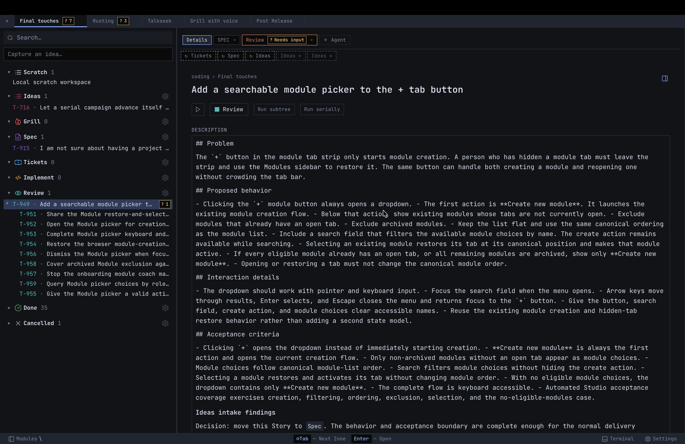
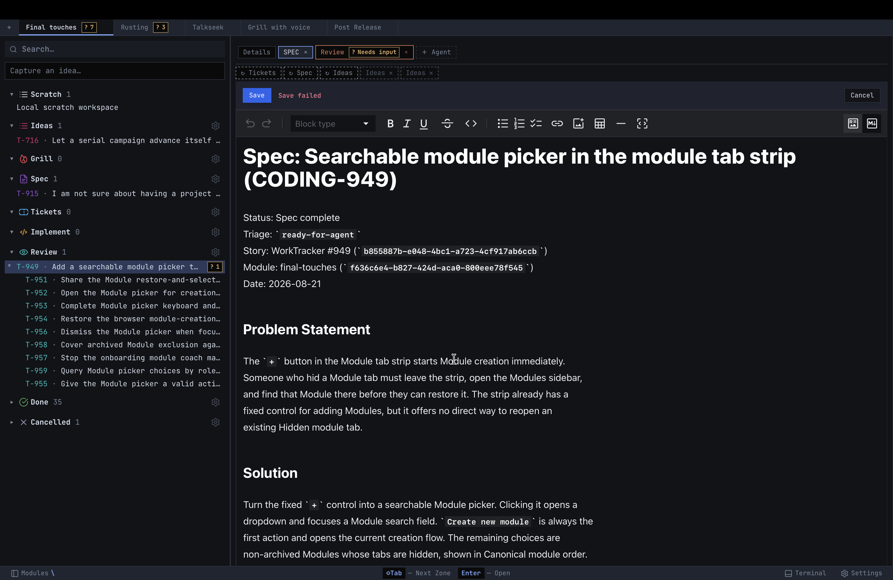

# Ticketry desktop application

Ticketry is a React application hosted by a Tauri desktop shell. The desktop
process owns the SeaORM database, Seaography GraphQL schema, MCP listener,
terminal lifecycle, and native host operations directly. There is no Python
product runtime or external REST contract.

<p align="center">
  <a href="https://github.com/ticketry-hq/ticketry/releases/download/0.2.0/Ticketry_0.2.0_aarch64.dmg">
    
  </a>
</p>

The current build requires macOS 11 or newer on an Apple silicon Mac. Release
downloads are available to repository collaborators.

```text
studio/   React/Vite frontend, Tauri shell, Rust services, and generated GraphQL contracts
scripts/  Development, validation, and release tooling
spec/     Application design history
```

## Screenshots







## Development

Install dependencies, then launch the canonical desktop application:

```bash
npm install
npm run desktop:dev
# or: pnpm run dev
```

The launcher rebuilds the Rust application as `Ticketry Dev`, with its own app
identifier and a per-worktree development profile. It can run beside an
installed `Ticketry` app without sharing data, tmux sessions, frontend ports,
or MCP listeners. MCP binds `mcp.sock` inside the owned data directory;
providers connect through the packaged `ticketry-hook mcp` stdio bridge.
Frontend, Rust runtime, and MCP output is written to
`.ticketry-dev/logs/ticketry.log`.
Every launch is also a startup measurement: once the desktop and the frontend
finish booting, the launcher prints their startup times against the median of
the last ten launches and shouts `STARTUP TIME REGRESSION` when one is more
than 1.25x slower. `npm run logs:startup` prints the same comparison.

To run that development build as the main app against the writable production
data and product tmux sessions, close the installed app first, then run:

```bash
npm run desktop:dev:prod
```

The production data-directory lock still applies, so a second Ticketry process
will refuse to start. The command respects `TICKETRY_DATA_DIR` and
`TICKETRY_DATA_DIR_NAME`, and keeps development diagnostics in
`.ticketry-dev/logs/ticketry.log` for agent inspection.

The production-data web launcher uses a small Rust GraphQL adapter. It shares
`~/.config/ticketry/state.db` and the product tmux namespace with the installed
app:

```bash
npm run web
```

Both web launchers also start the planner listener against the same in-process
GraphQL schema and stop it when the adapter exits. `TICKETRY_PLANNER_PORT` selects
a fixed loopback port; by default the OS chooses an available port. The launcher
prints the planner URL without its instance credential.

For browser development with the same per-worktree isolation as
`desktop:dev`, use:

```bash
npm run web:dev
```

Add `--log-to-file` to mirror browser console records and Rust story-move
diagnostics into `.ticketry-dev/logs/ticketry.log`:

```bash
npm run web -- --log-to-file
```

The production web launcher and installed app use the same product database
and tmux namespace. Only one may run at a time. The second process refuses to
open the data directory while the first process owns it.

[`config/product-identity.json`](config/product-identity.json) owns the default
data-directory name and the supported configuration variables. Set
`TICKETRY_DATA_DIR` to choose a full path, or `TICKETRY_DATA_DIR_NAME` to choose
one directory below `~/.config`.

Use `--temp-sqlite` with either command for a disposable profile. Ticketry
starts that profile empty, removes it after a clean exit, and stops only tmux
sessions created in its temporary namespace. Normal shutdown preserves
intentional tmux sessions.

## Production diagnostics

The installed app records frontend and Rust diagnostics by default, including
when opened from Finder. The legacy `--log-to-file` flag is still accepted.

```bash
/Applications/Ticketry.app/Contents/MacOS/ticketry --log-to-file
```

A launch of a store Rust already owns skips the whole-file SQLite integrity
check and semantic preflight. Add `--verify-store` (or set
`TICKETRY_VERIFY_STORE=1`) to run the full preflight, for example after an
update or when support asks:

```bash
/Applications/Ticketry.app/Contents/MacOS/ticketry --verify-store --log-to-file
```

The process writes `ticketry.log` in Ticketry's selected data directory, the
same path shown by the startup failure screen. Story moves record drop
resolution, state transition, rank allocation, GraphQL errors, and the final
module refresh.

## Validation

For Codex Cloud setup, see [the checked-in installer, start skill, and Linux
reproduction instructions](scripts/codex-cloud/README.md).

```bash
npm run caller:check
npm run typecheck
npm run test:overhaul --workspace @worktracker/studio
npm run test --workspace @worktracker/studio
npm run build --workspace @worktracker/studio
cargo check --locked --manifest-path studio/src-tauri/Cargo.toml
```

See [`studio/release/OPERATIONS.md`](studio/release/OPERATIONS.md) for build,
signing, notarization, installation, and recovery procedures.

## License

MIT. See [`LICENSE`](LICENSE).
