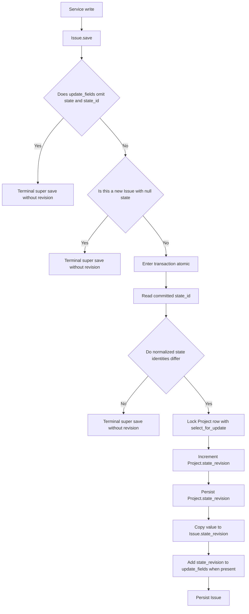
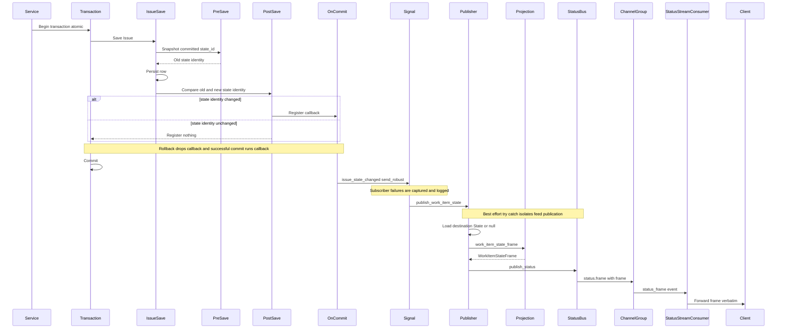
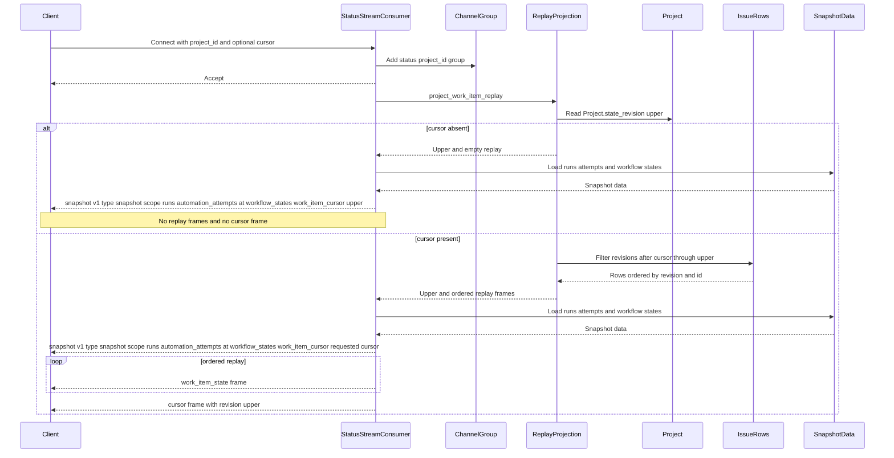

This document records the backend’s current work-item change publication and replay behavior only; it describes what the code does today and contains no proposed design (`backend/worktracker/models/issue.py:112`, `backend/apps/runs/consumers.py:22`).

## Revision allocation

`Issue.save` immediately delegates narrow saves whose `update_fields` omit `state` and `state_id`, and it separately delegates a create whose state is null (`backend/worktracker/models/issue.py:121`, `backend/worktracker/models/issue.py:126`). Other saves read the committed state identity inside `transaction.atomic` and allocate only when normalized old and new identities differ (`backend/worktracker/models/issue.py:129`, `backend/worktracker/models/issue.py:137`). `Project.next_state_revision` locks the project row, increments and saves its counter, and returns the allocated value that `Issue.save` copies to `Issue.state_revision` (`backend/worktracker/models/project.py:37`, `backend/worktracker/models/project.py:40`, `backend/worktracker/models/project.py:46`, `backend/worktracker/models/issue.py:138`). When a narrow state save supplied `update_fields`, `Issue.save` adds `state_revision` before persisting the issue (`backend/worktracker/models/issue.py:141`). The public `WorkItemOut` schema exposes `state_revision` to clients (`backend/worktracker/schemas.py:115`, `backend/worktracker/schemas.py:128`).

## Publication path

The service write is enclosed by `transaction.atomic` on create and update paths, while `Issue.save` also encloses revision allocation and row persistence atomically (`backend/worktracker/services/work_items.py:67`, `backend/worktracker/services/work_items.py:245`, `backend/worktracker/models/issue.py:129`). The `pre_save` receiver reads and stashes the committed `state_id`; the `post_save` receiver compares it with the new identity and registers `_emit` with `transaction.on_commit` only when they differ (`backend/worktracker/signals.py:84`, `backend/worktracker/signals.py:94`, `backend/worktracker/signals.py:99`, `backend/worktracker/signals.py:122`, `backend/worktracker/signals.py:145`). A rollback therefore runs no callback, and `_emit` uses `send_robust` so a raising subscriber is logged after the durable write rather than propagated to the writer (`backend/worktracker/signals.py:108`, `backend/worktracker/signals.py:171`, `backend/worktracker/signals.py:180`).

`publish_work_item_state` reads the destination `State` when present, constructs a `WorkItemStateFrame` through `work_item_state_frame`, and calls `publish_status`; its encompassing `try` and `except` make publication best-effort (`backend/apps/runs/signals.py:42`, `backend/apps/runs/signals.py:65`, `backend/apps/runs/signals.py:68`, `backend/apps/runs/signals.py:73`, `backend/apps/runs/signals.py:80`, `backend/apps/runs/signals.py:81`). The frame contains version, type, project, work item, projected state, revision, and update time; the nested state projection contains id, name, group, color, sort order, and protection (`backend/studio_server/contracts.py:236`, `backend/studio_server/contracts.py:239`, `backend/worktracker/state_projection.py:4`). `publish_status` sends a `status.frame` event carrying the frame to `status.PROJECT_ID`, and `StatusStreamConsumer.status_frame` forwards that frame unchanged to the client (`backend/apps/runs/bus.py:20`, `backend/apps/runs/bus.py:23`, `backend/apps/runs/bus.py:28`, `backend/apps/runs/consumers.py:60`).

## Connect and replay handshake

The `ws/status` route maps to `StatusStreamConsumer` (`backend/studio_server/routing.py:7`, `backend/studio_server/routing.py:8`). `StatusStreamConsumer.connect` requires a project id, parses the optional nonnegative cursor, joins `status.PROJECT_ID`, accepts the socket, and calls `project_work_item_replay` (`backend/apps/runs/consumers.py:22`, `backend/apps/runs/consumers.py:34`, `backend/apps/runs/consumers.py:38`, `backend/apps/runs/consumers.py:74`). Replay first captures `upper` from `Project.state_revision`; with no cursor it returns no replay rows, while a supplied cursor selects surviving issues with revisions greater than the cursor and no greater than `upper`, ordered by revision and id (`backend/apps/runs/projections.py:64`, `backend/apps/runs/projections.py:69`, `backend/apps/runs/projections.py:75`, `backend/apps/runs/projections.py:78`, `backend/apps/runs/projections.py:85`).

The snapshot always carries version one, type `snapshot`, scope, runs, automation attempts, time, workflow states, and a work-item cursor (`backend/studio_server/contracts.py:188`, `backend/studio_server/contracts.py:197`, `backend/studio_server/contracts.py:200`). With no supplied cursor, the snapshot cursor is `upper` and the consumer sends neither replay frames nor a terminating cursor frame; with a supplied cursor, the snapshot repeats that requested cursor, then sends the ordered replay frames and a final cursor frame at `upper` (`backend/apps/runs/consumers.py:42`, `backend/apps/runs/consumers.py:47`, `backend/apps/runs/consumers.py:52`, `backend/apps/runs/consumers.py:53`, `backend/apps/runs/consumers.py:56`). Replay is latest-per-item because each surviving `Issue` row stores only its latest `state_revision`; deleted rows are absent from the query and there is no tombstone model in this projection (`backend/worktracker/models/issue.py:50`, `backend/apps/runs/projections.py:78`).

## Write path inventory

| Service function | Fields or relations mutated | Allocates a new revision | Publishes a work_item_state frame | Appears in replay |
|---|---|---|---|---|
| `create_project_work_item` (`backend/worktracker/services/work_items.py:25`) | Creates an `Issue` with project, task type, name, sequence, rank, optional description and parent, resolved state, and issue type (`backend/worktracker/services/work_items.py:45`, `backend/worktracker/services/work_items.py:54`, `backend/worktracker/services/work_items.py:60`, `backend/worktracker/services/work_items.py:64`). | Conditional. A nonnull resolved birth state allocates; a null-state create returns without allocation (`backend/worktracker/models/issue.py:126`, `backend/worktracker/models/issue.py:137`). | Conditional. A nonnull birth changes state identity and schedules the signal; a null birth does not (`backend/worktracker/signals.py:122`, `backend/worktracker/signals.py:127`, `backend/apps/runs/signals.py:42`). | Conditional. The surviving row appears only when its allocated revision is greater than the supplied cursor and no greater than `upper` (`backend/apps/runs/projections.py:78`). |
| `create_review_finding` (`backend/worktracker/services/work_items.py:81`) | Delegates creation of a parented Implementation child with description and the Ready state (`backend/worktracker/services/work_items.py:165`, `backend/worktracker/services/work_items.py:175`). | Yes on a successful create because the delegated birth state is nonnull Ready (`backend/worktracker/services/work_items.py:165`, `backend/worktracker/services/work_items.py:179`, `backend/worktracker/models/issue.py:137`). | Yes on a successful create because the saved identity changes from null to Ready (`backend/worktracker/signals.py:89`, `backend/worktracker/signals.py:127`, `backend/apps/runs/signals.py:42`). | Yes while the created row survives and its revision falls inside the replay interval (`backend/apps/runs/projections.py:78`). |
| `create_module_work_item` (`backend/worktracker/services/work_items.py:185`) | Creates a task child with project, name, sequence, parent module, rank, optional description, issue type, and resolved birth state (`backend/worktracker/services/work_items.py:194`, `backend/worktracker/services/work_items.py:197`, `backend/worktracker/services/work_items.py:207`, `backend/worktracker/services/work_items.py:213`). | Conditional. A nonnull resolved birth state allocates; a null-state create returns without allocation (`backend/worktracker/models/issue.py:126`, `backend/worktracker/models/issue.py:137`). | Conditional. Only a nonnull birth changes state identity and reaches the publisher (`backend/worktracker/signals.py:122`, `backend/worktracker/signals.py:127`, `backend/apps/runs/signals.py:42`). | Conditional. A surviving row with an allocated revision appears when that revision falls inside the replay interval (`backend/apps/runs/projections.py:78`). |
| `update_work_item` (`backend/worktracker/services/work_items.py:222`) | Either routes a state-only patch through `transition_state`, or saves parent, name, or description and then replaces blocker or label relations (`backend/worktracker/services/work_items.py:237`, `backend/worktracker/services/work_items.py:254`, `backend/worktracker/services/work_items.py:267`, `backend/worktracker/services/work_items.py:274`, `backend/worktracker/services/work_items.py:277`, `backend/worktracker/services/work_items.py:285`). | Only when the state-only branch changes `state_id` identity; field and M2M edits do not (`backend/worktracker/models/issue.py:121`, `backend/worktracker/models/issue.py:137`). | Only when the state-only branch changes `state_id` identity (`backend/worktracker/signals.py:122`, `backend/worktracker/signals.py:127`, `backend/apps/runs/signals.py:42`). | Only the latest surviving state revision is represented; non-state edits have no replay entry of their own (`backend/apps/runs/projections.py:78`, `backend/apps/runs/projections.py:87`). |
| `reorder_work_item` (`backend/worktracker/services/work_items.py:291`) | Saves only rank and update time on the moved issue (`backend/worktracker/services/work_items.py:301`, `backend/worktracker/services/work_items.py:306`). | No. Its `update_fields` omit state and state id, so `Issue.save` returns through the narrow-save branch (`backend/worktracker/models/issue.py:121`). | No. State identity is unchanged and the post-save receiver returns (`backend/worktracker/signals.py:122`, `backend/worktracker/signals.py:127`). | No rank mutation is represented in the state replay (`backend/apps/runs/projections.py:78`, `backend/apps/runs/projections.py:88`). |
| `delete_work_item` (`backend/worktracker/services/work_items.py:310`) | Deletes an `Issue` after rejecting rows that still have children (`backend/worktracker/services/work_items.py:313`, `backend/worktracker/services/work_items.py:316`). | No. The path calls `delete`, not `Issue.save` (`backend/worktracker/services/work_items.py:316`, `backend/worktracker/models/issue.py:112`). | No. The publication seam is attached to issue `pre_save` and `post_save`, not delete (`backend/worktracker/signals.py:84`, `backend/worktracker/signals.py:99`). | No. Replay queries only surviving `Issue` rows and creates no tombstone (`backend/apps/runs/projections.py:78`, `backend/apps/runs/projections.py:87`). |
| `transition_state` (`backend/worktracker/workflow.py`) | Validates the configured edge, sets the root state, and toggles root archive status on entry to or exit from cancelled. | Only when the assigned target changes state identity (`backend/worktracker/models/issue.py:137`). | Only when the assigned target changes state identity (`backend/worktracker/signals.py:122`, `backend/worktracker/signals.py:127`, `backend/apps/runs/signals.py:42`). | The root’s latest surviving state revision appears when it falls inside the replay interval (`backend/apps/runs/projections.py:78`). |
| Cancellation descendant archive (`backend/worktracker/workflow.py:142`) | Bulk sets `is_archived` on every discovered descendant while leaving descendant state unchanged (`backend/worktracker/workflow.py:143`, `backend/worktracker/workflow.py:149`, `backend/worktracker/work_items.py:47`, `backend/worktracker/work_items.py:60`). | No. The bulk `update` bypasses `Issue.save` and changes no descendant state identity (`backend/worktracker/work_items.py:61`, `backend/worktracker/models/issue.py:112`). | No. The descendant bulk update invokes neither issue save receiver (`backend/worktracker/work_items.py:61`, `backend/worktracker/signals.py:84`, `backend/worktracker/signals.py:99`). | No descendant archive mutation is represented in replay, which projects only state and state revision from surviving rows (`backend/apps/runs/projections.py:78`, `backend/apps/runs/projections.py:88`). |

## Publication gaps

- Non-state saves such as name, description, and parent changes leave `state_id` unchanged, so the state-change receiver emits nothing for them (`backend/worktracker/services/work_items.py:267`, `backend/worktracker/services/work_items.py:274`, `backend/worktracker/signals.py:103`, `backend/worktracker/signals.py:127`).
- Label and blocker M2M replacements occur after `Issue.save` and never touch the issue revision (`backend/worktracker/services/work_items.py:274`, `backend/worktracker/services/work_items.py:277`, `backend/worktracker/services/work_items.py:285`, `backend/worktracker/models/issue.py:137`).
- `reorder_work_item` saves rank and update time through `update_fields`; because those fields omit state and state id, `Issue.save` returns without revision allocation and no state frame is emitted (`backend/worktracker/services/work_items.py:291`, `backend/worktracker/services/work_items.py:306`, `backend/worktracker/models/issue.py:121`, `backend/worktracker/signals.py:127`).
- `delete_work_item` emits no work-item-state signal, and replay has no tombstone because it selects only surviving `Issue` rows (`backend/worktracker/services/work_items.py:310`, `backend/worktracker/services/work_items.py:316`, `backend/worktracker/signals.py:84`, `backend/worktracker/signals.py:99`, `backend/apps/runs/projections.py:78`).
- Cancellation bulk-archives descendants by changing only `is_archived`; descendant rows receive no revision bump, no frame, and no replay representation of that archive mutation (`backend/worktracker/workflow.py:142`, `backend/worktracker/workflow.py:149`, `backend/worktracker/work_items.py:47`, `backend/worktracker/work_items.py:61`, `backend/apps/runs/projections.py:88`).
