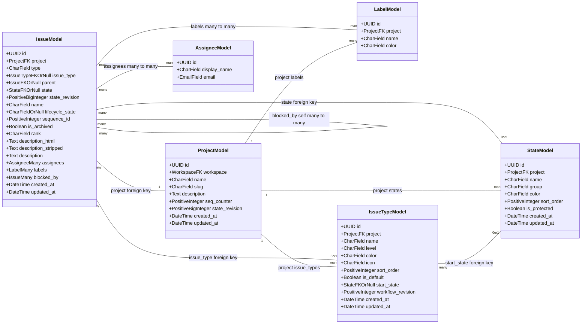
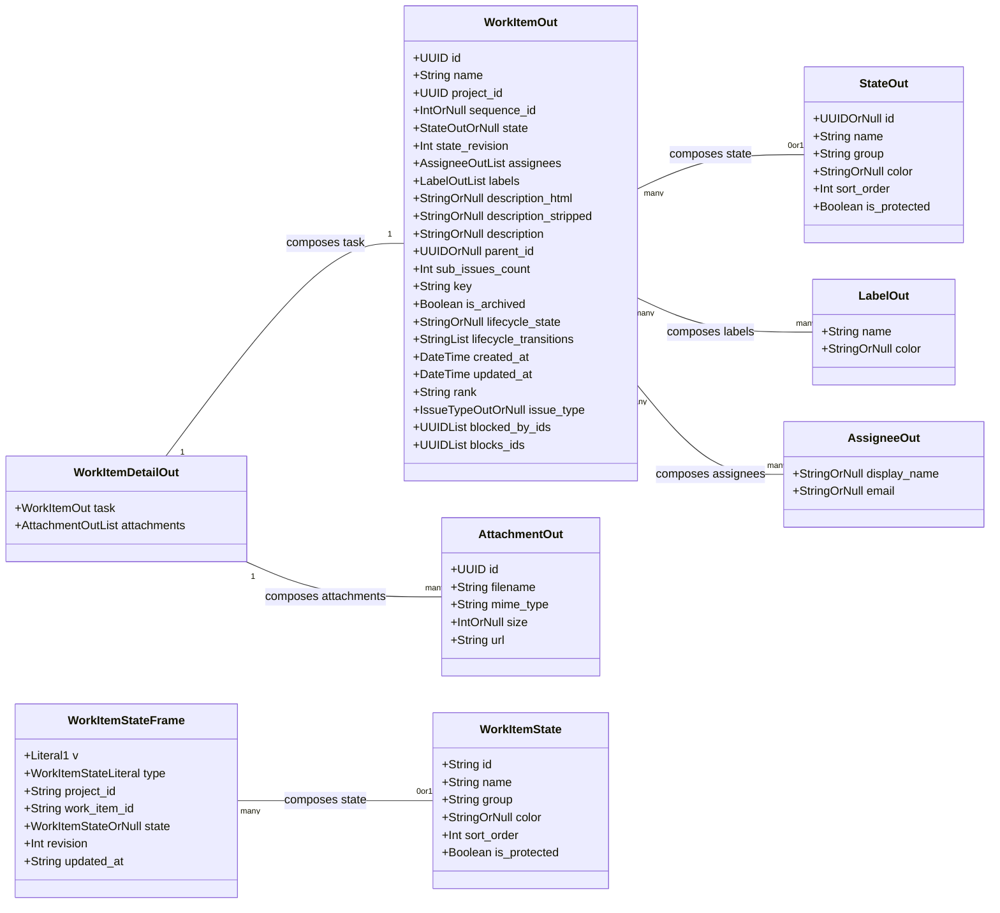
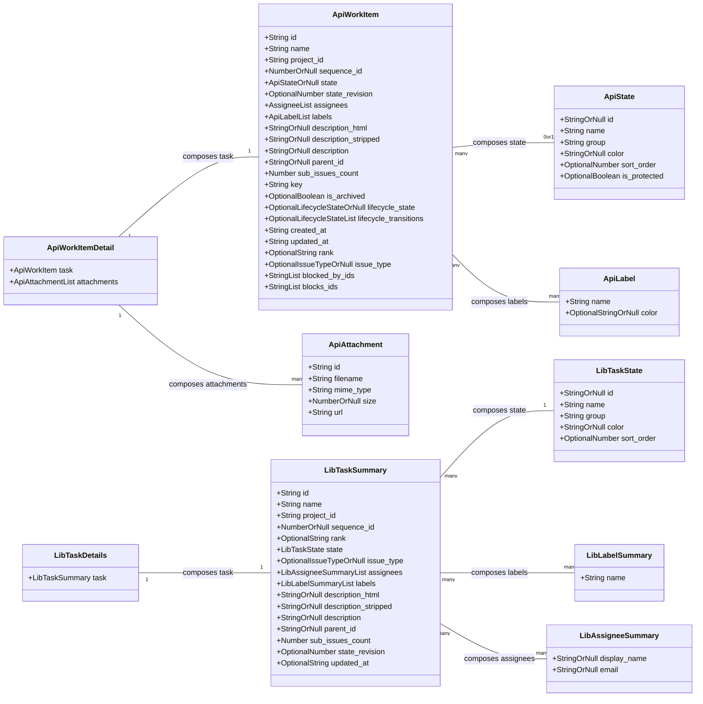

# Work-item data models

This document compares the existing work-item data shapes across three layers: the persisted Django model, the published wire contracts, and the client-side types; it records current definitions only (`backend/worktracker/models/issue.py:11`, `backend/worktracker/schemas.py:115`, `studio/src/shared/api/types.ts:107`, `studio/src/features/studio/lib/types.ts:51`).

## Persisted model

Every `IssueModel` member above comes from the declared fields at `backend/worktracker/models/issue.py:24`, `backend/worktracker/models/issue.py:91`; the computed `key` property is not a persisted member (`backend/worktracker/models/issue.py:104`). The other class members come from `backend/worktracker/models/project.py:15`, `backend/worktracker/models/project.py:28`, `backend/worktracker/models/state.py:14`, `backend/worktracker/models/state.py:24`, `backend/worktracker/models/label.py:8`, `backend/worktracker/models/label.py:13`, `backend/worktracker/models/assignee.py:7`, `backend/worktracker/models/assignee.py:9`, `backend/worktracker/models/issue_type.py:17`, and `backend/worktracker/models/issue_type.py:36`.

The `IssueModel` edges are the nullable parent self-reference (`backend/worktracker/models/issue.py:36`), nullable state foreign key (`backend/worktracker/models/issue.py:43`), directed blocker many-to-many (`backend/worktracker/models/issue.py:84`), label many-to-many (`backend/worktracker/models/issue.py:78`), assignee many-to-many (`backend/worktracker/models/issue.py:77`), required project foreign key (`backend/worktracker/models/issue.py:25`), and nullable issue-type foreign key (`backend/worktracker/models/issue.py:29`). The remaining edges are the project-owned states (`backend/worktracker/models/state.py:15`), labels (`backend/worktracker/models/label.py:9`), issue types (`backend/worktracker/models/issue_type.py:18`), and the nullable issue-type start state (`backend/worktracker/models/issue_type.py:27`).

## Wire contracts

The HTTP contract members and composition edges come from `StateOut` (`backend/worktracker/schemas.py:15`), `AssigneeOut` (`backend/worktracker/schemas.py:100`), `LabelOut` (`backend/worktracker/schemas.py:107`), `WorkItemOut` (`backend/worktracker/schemas.py:115`, `backend/worktracker/schemas.py:160`), `AttachmentOut` (`backend/worktracker/schemas.py:197`), and `WorkItemDetailOut` (`backend/worktracker/schemas.py:212`). The separate status-feed members and their nested-state composition come from `WorkItemState` and `WorkItemStateFrame` (`backend/studio_server/contracts.py:225`, `backend/studio_server/contracts.py:245`); the state projection supplies the same six nested state fields (`backend/worktracker/state_projection.py:4`, `backend/worktracker/state_projection.py:11`).

## Client types

The `Api` family members and composition edges come from the shared aliases and refinements for `State`, `Label`, `WorkItem`, `Attachment`, and `WorkItemDetail` (`studio/src/shared/api/types.ts:70`, `studio/src/shared/api/types.ts:81`, `studio/src/shared/api/types.ts:105`, `studio/src/shared/api/types.ts:107`, `studio/src/shared/api/types.ts:156`), with retained generated `WorkItemOut` members supplied through the imported base (`studio/src/shared/api/types.ts:1`, `studio/src/shared/api/types.ts:25`, `surfaces/worktracker-typescript-sdk/src/generated/models/WorkItemOut.ts:56`, `surfaces/worktracker-typescript-sdk/src/generated/models/WorkItemOut.ts:195`). The `Lib` family members and composition edges come from `TaskState`, `AssigneeSummary`, `LabelSummary`, `TaskSummary`, and `TaskDetails` (`studio/src/features/studio/lib/types.ts:33`, `studio/src/features/studio/lib/types.ts:81`).

## Field correspondence

The table compares top-level work-item fields; nested object types retain the separately diagrammed shapes (`backend/worktracker/schemas.py:115`, `backend/studio_server/contracts.py:236`, `studio/src/shared/api/types.ts:107`, `studio/src/features/studio/lib/types.ts:51`).

| Field | Issue model | WorkItemOut | WorkItemStateFrame | api types WorkItem | studio lib TaskSummary |
|---|---|---|---|---|---|
| `id` | `id: UUIDField` (`backend/worktracker/models/issue.py:24`) | `id: uuid.UUID` (`backend/worktracker/schemas.py:123`) | — (`backend/studio_server/contracts.py:236`, `backend/studio_server/contracts.py:245`) | `id: string` retained from generated base (`studio/src/shared/api/types.ts:107`, `surfaces/worktracker-typescript-sdk/src/generated/models/WorkItemOut.ts:104`) | `id: string` (`studio/src/features/studio/lib/types.ts:52`) |
| `name` | `name: CharField` (`backend/worktracker/models/issue.py:53`) | `name: str` (`backend/worktracker/schemas.py:124`) | — (`backend/studio_server/contracts.py:236`, `backend/studio_server/contracts.py:245`) | `name: string` retained from generated base (`studio/src/shared/api/types.ts:107`, `surfaces/worktracker-typescript-sdk/src/generated/models/WorkItemOut.ts:146`) | `name: string` (`studio/src/features/studio/lib/types.ts:53`) |
| `project_id` | `project_id: UUID` foreign-key storage for `project` (`backend/worktracker/models/issue.py:25`) | `project_id: uuid.UUID` (`backend/worktracker/schemas.py:125`) | `project_id: str` (`backend/studio_server/contracts.py:241`) | `project_id: string` retained from generated base (`studio/src/shared/api/types.ts:107`, `surfaces/worktracker-typescript-sdk/src/generated/models/WorkItemOut.ts:158`) | `project_id: string` (`studio/src/features/studio/lib/types.ts:54`) |
| `sequence_id` | `sequence_id: PositiveIntegerField` (`backend/worktracker/models/issue.py:65`) | `sequence_id: Optional[int]` (`backend/worktracker/schemas.py:126`) | — (`backend/studio_server/contracts.py:236`, `backend/studio_server/contracts.py:245`) | `sequence_id: number \| null` (`studio/src/shared/api/types.ts:125`) | `sequence_id: number \| null` (`studio/src/features/studio/lib/types.ts:55`) |
| `key` | `key: str` computed property (`backend/worktracker/models/issue.py:104`, `backend/worktracker/models/issue.py:107`) | `key: str` (`backend/worktracker/schemas.py:136`) | — (`backend/studio_server/contracts.py:236`, `backend/studio_server/contracts.py:245`) | `key: string` retained from generated base (`studio/src/shared/api/types.ts:107`, `surfaces/worktracker-typescript-sdk/src/generated/models/WorkItemOut.ts:122`) | — (`studio/src/features/studio/lib/types.ts:51`, `studio/src/features/studio/lib/types.ts:77`) |
| `state` | `state: ForeignKey[State] \| null` (`backend/worktracker/models/issue.py:43`, `backend/worktracker/models/issue.py:48`) | `state: Optional[StateOut]` (`backend/worktracker/schemas.py:127`) | `state: Optional[WorkItemState]` (`backend/studio_server/contracts.py:243`) | `state: State \| null` (`studio/src/shared/api/types.ts:126`) | `state: TaskState` (`studio/src/features/studio/lib/types.ts:59`) |
| `state_revision` | `state_revision: PositiveBigIntegerField` (`backend/worktracker/models/issue.py:52`) | `state_revision: int` (`backend/worktracker/schemas.py:128`) | —; the corresponding frame field is `revision` (`backend/studio_server/contracts.py:244`) | `state_revision?: number` retained from generated base (`studio/src/shared/api/types.ts:107`, `surfaces/worktracker-typescript-sdk/src/generated/models/WorkItemOut.ts:182`) | `state_revision?: number` (`studio/src/features/studio/lib/types.ts:73`) |
| `updated_at` | `updated_at: DateTimeField` (`backend/worktracker/models/issue.py:91`) | `updated_at: datetime` (`backend/worktracker/schemas.py:149`) | `updated_at: str` (`backend/studio_server/contracts.py:245`) | `updated_at: string` retained from generated base (`studio/src/shared/api/types.ts:107`, `surfaces/worktracker-typescript-sdk/src/generated/models/WorkItemOut.ts:194`) | `updated_at?: string` (`studio/src/features/studio/lib/types.ts:76`) |
| `created_at` | `created_at: DateTimeField` (`backend/worktracker/models/issue.py:90`) | `created_at: datetime` (`backend/worktracker/schemas.py:148`) | — (`backend/studio_server/contracts.py:236`, `backend/studio_server/contracts.py:245`) | `created_at: string` retained from generated base (`studio/src/shared/api/types.ts:107`, `surfaces/worktracker-typescript-sdk/src/generated/models/WorkItemOut.ts:80`) | — (`studio/src/features/studio/lib/types.ts:51`, `studio/src/features/studio/lib/types.ts:77`) |
| `parent_id` | `parent_id: UUID \| null` foreign-key storage for `parent` (`backend/worktracker/models/issue.py:36`, `backend/worktracker/models/issue.py:41`) | `parent_id: Optional[uuid.UUID]` (`backend/worktracker/schemas.py:134`) | — (`backend/studio_server/contracts.py:236`, `backend/studio_server/contracts.py:245`) | `parent_id: string \| null` (`studio/src/shared/api/types.ts:134`) | `parent_id: string \| null` (`studio/src/features/studio/lib/types.ts:69`) |
| `labels` | `labels: ManyToManyField[Label]` (`backend/worktracker/models/issue.py:78`) | `labels: List[LabelOut]` (`backend/worktracker/schemas.py:130`) | — (`backend/studio_server/contracts.py:236`, `backend/studio_server/contracts.py:245`) | `labels: Label[]` (`studio/src/shared/api/types.ts:130`) | `labels: LabelSummary[]` (`studio/src/features/studio/lib/types.ts:65`) |
| `assignees` | `assignees: ManyToManyField[Assignee]` (`backend/worktracker/models/issue.py:77`) | `assignees: List[AssigneeOut]` (`backend/worktracker/schemas.py:129`) | — (`backend/studio_server/contracts.py:236`, `backend/studio_server/contracts.py:245`) | `assignees: Assignee[]` (`studio/src/shared/api/types.ts:104`, `studio/src/shared/api/types.ts:129`) | `assignees: AssigneeSummary[]` (`studio/src/features/studio/lib/types.ts:64`) |
| `blocked_by_ids` | `blocked_by: ManyToManyField[Issue]` (`backend/worktracker/models/issue.py:84`, `backend/worktracker/models/issue.py:89`) | `blocked_by_ids: List[uuid.UUID]` (`backend/worktracker/schemas.py:159`) | — (`backend/studio_server/contracts.py:236`, `backend/studio_server/contracts.py:245`) | `blocked_by_ids: string[]` (`studio/src/shared/api/types.ts:138`) | — (`studio/src/features/studio/lib/types.ts:51`, `studio/src/features/studio/lib/types.ts:77`) |
| `blocks_ids` | `blocks: reverse ManyToMany manager` (`backend/worktracker/models/issue.py:81`, `backend/worktracker/models/issue.py:88`) | `blocks_ids: List[uuid.UUID]` (`backend/worktracker/schemas.py:160`) | — (`backend/studio_server/contracts.py:236`, `backend/studio_server/contracts.py:245`) | `blocks_ids: string[]` (`studio/src/shared/api/types.ts:139`) | — (`studio/src/features/studio/lib/types.ts:51`, `studio/src/features/studio/lib/types.ts:77`) |
| `sub_issues_count` | —; children exist through the reverse `children` relation, not a field (`backend/worktracker/models/issue.py:41`, `backend/worktracker/models/issue.py:91`) | `sub_issues_count: int` (`backend/worktracker/schemas.py:135`) | — (`backend/studio_server/contracts.py:236`, `backend/studio_server/contracts.py:245`) | `sub_issues_count: number` (`studio/src/shared/api/types.ts:135`) | `sub_issues_count: number` (`studio/src/features/studio/lib/types.ts:70`) |
| `description` | `description: TextField` (`backend/worktracker/models/issue.py:76`) | `description: Optional[str]` (`backend/worktracker/schemas.py:133`) | — (`backend/studio_server/contracts.py:236`, `backend/studio_server/contracts.py:245`) | `description: string \| null` (`studio/src/shared/api/types.ts:133`) | `description: string \| null` (`studio/src/features/studio/lib/types.ts:68`) |
| `description_html` | `description_html: TextField` (`backend/worktracker/models/issue.py:74`) | `description_html: Optional[str]` (`backend/worktracker/schemas.py:131`) | — (`backend/studio_server/contracts.py:236`, `backend/studio_server/contracts.py:245`) | `description_html: string \| null` (`studio/src/shared/api/types.ts:131`) | `description_html: string \| null` (`studio/src/features/studio/lib/types.ts:66`) |
| `description_stripped` | `description_stripped: TextField` (`backend/worktracker/models/issue.py:75`) | `description_stripped: Optional[str]` (`backend/worktracker/schemas.py:132`) | — (`backend/studio_server/contracts.py:236`, `backend/studio_server/contracts.py:245`) | `description_stripped: string \| null` (`studio/src/shared/api/types.ts:132`) | `description_stripped: string \| null` (`studio/src/features/studio/lib/types.ts:67`) |
| `rank` | `rank: CharField` (`backend/worktracker/models/issue.py:73`) | `rank: str` (`backend/worktracker/schemas.py:153`) | — (`backend/studio_server/contracts.py:236`, `backend/studio_server/contracts.py:245`) | `rank?: string` (`studio/src/shared/api/types.ts:137`) | `rank?: string` (`studio/src/features/studio/lib/types.ts:58`) |
| `is_archived` | `is_archived: BooleanField` (`backend/worktracker/models/issue.py:66`) | `is_archived: bool` (`backend/worktracker/schemas.py:137`) | — (`backend/studio_server/contracts.py:236`, `backend/studio_server/contracts.py:245`) | `is_archived?: boolean` (`studio/src/shared/api/types.ts:136`) | — (`studio/src/features/studio/lib/types.ts:51`, `studio/src/features/studio/lib/types.ts:77`) |
| `lifecycle_state` | `lifecycle_state: CharField \| null` (`backend/worktracker/models/issue.py:58`, `backend/worktracker/models/issue.py:64`) | `lifecycle_state: Optional[str]` (`backend/worktracker/schemas.py:144`) | — (`backend/studio_server/contracts.py:236`, `backend/studio_server/contracts.py:245`) | `lifecycle_state?: LifecycleState \| null` (`studio/src/shared/api/types.ts:83`, `studio/src/shared/api/types.ts:102`, `studio/src/shared/api/types.ts:127`) | — (`studio/src/features/studio/lib/types.ts:51`, `studio/src/features/studio/lib/types.ts:77`) |
| `lifecycle_transitions` | — (`backend/worktracker/models/issue.py:24`, `backend/worktracker/models/issue.py:91`) | `lifecycle_transitions: List[str]` (`backend/worktracker/schemas.py:145`) | — (`backend/studio_server/contracts.py:236`, `backend/studio_server/contracts.py:245`) | `lifecycle_transitions?: LifecycleState[]` (`studio/src/shared/api/types.ts:128`) | — (`studio/src/features/studio/lib/types.ts:51`, `studio/src/features/studio/lib/types.ts:77`) |
| `type` | `type: CharField` (`backend/worktracker/models/issue.py:28`) | — (`backend/worktracker/schemas.py:115`, `backend/worktracker/schemas.py:160`) | `type: Literal["work_item_state"]` envelope discriminator (`backend/studio_server/contracts.py:240`) | — (`studio/src/shared/api/types.ts:107`, `studio/src/shared/api/types.ts:140`) | — (`studio/src/features/studio/lib/types.ts:51`, `studio/src/features/studio/lib/types.ts:77`) |
| `issue_type` | `issue_type: ForeignKey[IssueType] \| null` (`backend/worktracker/models/issue.py:29`, `backend/worktracker/models/issue.py:35`) | `issue_type: Optional[IssueTypeOut]` (`backend/worktracker/schemas.py:154`) | — (`backend/studio_server/contracts.py:236`, `backend/studio_server/contracts.py:245`) | `issue_type?: IssueTypeOut \| null` retained from generated base (`studio/src/shared/api/types.ts:107`, `surfaces/worktracker-typescript-sdk/src/generated/models/WorkItemOut.ts:116`) | `issue_type?: IssueTypeOut \| null` (`studio/src/features/studio/lib/types.ts:63`) |
| `v` | — (`backend/worktracker/models/issue.py:24`, `backend/worktracker/models/issue.py:91`) | — (`backend/worktracker/schemas.py:115`, `backend/worktracker/schemas.py:160`) | `v: Literal[1]` (`backend/studio_server/contracts.py:239`) | — (`studio/src/shared/api/types.ts:107`, `studio/src/shared/api/types.ts:140`) | — (`studio/src/features/studio/lib/types.ts:51`, `studio/src/features/studio/lib/types.ts:77`) |
| `work_item_id` | —; the model identifier is `id` (`backend/worktracker/models/issue.py:24`) | —; the contract identifier is `id` (`backend/worktracker/schemas.py:123`) | `work_item_id: str` (`backend/studio_server/contracts.py:242`) | —; the client identifier is `id` (`studio/src/shared/api/types.ts:107`, `surfaces/worktracker-typescript-sdk/src/generated/models/WorkItemOut.ts:104`) | —; the client identifier is `id` (`studio/src/features/studio/lib/types.ts:52`) |
| `revision` | —; the model field is `state_revision` (`backend/worktracker/models/issue.py:52`) | —; the contract field is `state_revision` (`backend/worktracker/schemas.py:128`) | `revision: int` (`backend/studio_server/contracts.py:244`) | —; the client field is `state_revision?: number` (`studio/src/shared/api/types.ts:107`, `surfaces/worktracker-typescript-sdk/src/generated/models/WorkItemOut.ts:182`) | —; the client field is `state_revision?: number` (`studio/src/features/studio/lib/types.ts:73`) |

## Divergences

- `Issue.type` is persisted but has no `WorkItemOut` field; the persisted `project`, `parent`, `state`, `issue_type`, `blocked_by`, and reverse `blocks` shapes appear on the wire as `project_id`, `parent_id`, nested `state`, nested `issue_type`, `blocked_by_ids`, and `blocks_ids` (`backend/worktracker/models/issue.py:25`, `backend/worktracker/models/issue.py:29`, `backend/worktracker/models/issue.py:36`, `backend/worktracker/models/issue.py:43`, `backend/worktracker/models/issue.py:84`, `backend/worktracker/schemas.py:125`, `backend/worktracker/schemas.py:127`, `backend/worktracker/schemas.py:134`, `backend/worktracker/schemas.py:154`, `backend/worktracker/schemas.py:159`, `backend/worktracker/schemas.py:160`).
- `WorkItemOut` fields absent from `TaskSummary` are `key`, `is_archived`, `lifecycle_state`, `lifecycle_transitions`, `created_at`, `blocked_by_ids`, and `blocks_ids`; `TaskSummary` has no top-level field absent from `WorkItemOut` (`backend/worktracker/schemas.py:115`, `backend/worktracker/schemas.py:160`, `studio/src/features/studio/lib/types.ts:51`, `studio/src/features/studio/lib/types.ts:77`).
- `WorkItemStateFrame` carries only `project_id`, `work_item_id`, `state`, `revision`, and `updated_at` as work-item data, plus the `v` and `type` envelope fields; it carries no other `WorkItemOut` field (`backend/studio_server/contracts.py:236`, `backend/studio_server/contracts.py:245`, `backend/worktracker/schemas.py:115`, `backend/worktracker/schemas.py:160`).
- The shared API family names the representations `WorkItem` and `State`, while the studio-lib family names them `TaskSummary` and `TaskState`; `WorkItem.state` is nullable, whereas `TaskSummary.state` is not nullable (`studio/src/shared/api/types.ts:70`, `studio/src/shared/api/types.ts:107`, `studio/src/shared/api/types.ts:126`, `studio/src/features/studio/lib/types.ts:33`, `studio/src/features/studio/lib/types.ts:51`, `studio/src/features/studio/lib/types.ts:59`).
- Shared API `WorkItem.updated_at` is required and `created_at` is present, while studio-lib `TaskSummary.updated_at` is optional and `created_at` is absent (`studio/src/shared/api/types.ts:107`, `surfaces/worktracker-typescript-sdk/src/generated/models/WorkItemOut.ts:80`, `surfaces/worktracker-typescript-sdk/src/generated/models/WorkItemOut.ts:194`, `studio/src/features/studio/lib/types.ts:51`, `studio/src/features/studio/lib/types.ts:76`).
- Shared API `State` alone includes optional `is_protected`; shared API `Label` includes optional nullable `color`, while `TaskState` has no `is_protected` and `LabelSummary` has no `color` (`studio/src/shared/api/types.ts:70`, `studio/src/shared/api/types.ts:80`, `studio/src/shared/api/types.ts:105`, `surfaces/worktracker-typescript-sdk/src/generated/models/LabelOut.ts:30`, `studio/src/features/studio/lib/types.ts:33`, `studio/src/features/studio/lib/types.ts:49`).
- Shared API `WorkItemDetail` includes `attachments: Attachment[]`, while studio-lib `TaskDetails` contains only `task`; shared API `Attachment` has no studio-lib counterpart in these declarations (`studio/src/shared/api/types.ts:142`, `studio/src/shared/api/types.ts:156`, `studio/src/features/studio/lib/types.ts:79`, `studio/src/features/studio/lib/types.ts:81`).
- Shared API `Assignee` retains optional nullable `display_name` and `email` from `AssigneeOut`, while studio-lib `AssigneeSummary` requires both properties while allowing each value to be null (`studio/src/shared/api/types.ts:2`, `studio/src/shared/api/types.ts:104`, `surfaces/worktracker-typescript-sdk/src/generated/models/AssigneeOut.ts:23`, `surfaces/worktracker-typescript-sdk/src/generated/models/AssigneeOut.ts:35`, `studio/src/features/studio/lib/types.ts:42`, `studio/src/features/studio/lib/types.ts:45`).
