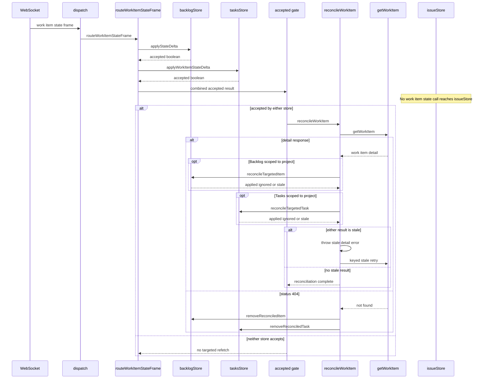

This file maps the Studio frontend’s current browser-cached work-item state and its existing synchronization paths only; it describes what the code does today and contains no proposed design.

## Cached work-item copies

```mermaid
graph TD
  LOADERS[API load actions]
  MUTATIONS[Local mutation actions]
  FEED[Status feed]
  CATALOG_SYNC[State catalog synchronization]

  subgraph BACKLOG[backlogStore]
    BS_ITEMS["backlogStore.items"]
    BS_SEEN["backlogStore.seenStateRevisions"]
    BS_PENDING["backlogStore.pendingStateDeltas"]
  end

  subgraph TASKS[tasksStore]
    TS_TASKS["tasksStore.tasks"]
    TS_SUBTASKS["tasksStore.subtasks"]
    TS_DETAILS["tasksStore.details"]
    TS_SEEN["tasksStore.seenStateRevisions"]
    TS_PENDING["tasksStore.pendingStateDeltas"]
  end

  subgraph ISSUE[issueStore]
    IS_OPEN["issueStore.open"]
    IS_CHILDREN["issueStore.children"]
  end

  subgraph AGENT[agent status store]
    AS_CURSORS["agentStatusStore.workItemCursors"]
  end

  subgraph SHARED[shared state catalog revision]
    SC_MODULE[Project revisions authoritative states and generation]
  end

  BACKLOG_RENDER[IssueDetail and picker fields]
  TASK_RENDER[TasksPane TaskRow and ParentUpdate]
  DETAILS_RENDER[DetailsTab and ParentUpdate]
  ISSUE_RENDER[IssueDetail]
  CHILD_RENDER[ChildIssues and FindingsPanel]

  LOADERS -->|loadBacklog| BS_ITEMS
  MUTATIONS -->|optimistic actions and applyServerItem| BS_ITEMS
  FEED -->|applyStateDelta and reconcileTargetedItem| BS_ITEMS
  FEED -->|applyStateDelta| BS_SEEN
  FEED -->|applyStateDelta| BS_PENDING
  BS_PENDING -->|loadBacklog overlay| BS_ITEMS
  BS_ITEMS -->|items selector| BACKLOG_RENDER

  LOADERS -->|loadTasks| TS_TASKS
  LOADERS -->|loadTasks and loadSubtasks| TS_SUBTASKS
  LOADERS -->|loadDetails| TS_DETAILS
  MUTATIONS -->|task update and reorder actions| TS_TASKS
  MUTATIONS -->|task update and reorder actions| TS_SUBTASKS
  MUTATIONS -->|task update and reorder actions| TS_DETAILS
  FEED -->|applyWorkItemStateDelta and reconcileTargetedTask| TS_TASKS
  FEED -->|applyWorkItemStateDelta and reconcileTargetedTask| TS_SUBTASKS
  FEED -->|applyWorkItemStateDelta and reconcileTargetedTask| TS_DETAILS
  FEED -->|applyWorkItemStateDelta| TS_SEEN
  FEED -->|applyWorkItemStateDelta| TS_PENDING
  TS_PENDING -->|loadTasks overlay| TS_TASKS
  TS_PENDING -->|loadTasks overlay| TS_SUBTASKS
  TS_TASKS -->|task tree selector| TASK_RENDER
  TS_SUBTASKS -->|task tree selector| TASK_RENDER
  TS_DETAILS -->|details selector| DETAILS_RENDER

  LOADERS -->|openIssue and reloadIssue| IS_OPEN
  LOADERS -->|openIssue and reloadChildren| IS_CHILDREN
  MUTATIONS -->|patchField and addSubtask| IS_OPEN
  MUTATIONS -->|addSubtask and cancelChild| IS_CHILDREN
  IS_OPEN -->|open selector| ISSUE_RENDER
  IS_CHILDREN -->|children selector| ISSUE_RENDER
  IS_CHILDREN -->|children props| CHILD_RENDER

  FEED -->|acceptWorkItemCursor| AS_CURSORS
  AS_CURSORS -->|remembered cursor| FEED

  FEED -->|workflow state route| CATALOG_SYNC
  CATALOG_SYNC -->|advanceStateCatalogRevision| SC_MODULE
  CATALOG_SYNC -->|synchronizeActiveStateCatalogs| BS_ITEMS
  CATALOG_SYNC -->|synchronizeActiveStateCatalogs| TS_TASKS
  CATALOG_SYNC -->|synchronizeActiveStateCatalogs| TS_SUBTASKS
  CATALOG_SYNC -->|synchronizeActiveStateCatalogs| TS_DETAILS
  CATALOG_SYNC -->|synchronizeActiveStateCatalogs| IS_OPEN
  CATALOG_SYNC -->|synchronizeActiveStateCatalogs| IS_CHILDREN
  SC_MODULE -->|overlayAuthoritativeState after requests| BS_ITEMS
  SC_MODULE -->|overlayAuthoritativeState after requests| TS_TASKS
  SC_MODULE -->|overlayAuthoritativeState after requests| TS_SUBTASKS
  SC_MODULE -->|overlayAuthoritativeState after requests| TS_DETAILS
  SC_MODULE -->|overlayAuthoritativeState after requests| IS_OPEN
  SC_MODULE -->|overlayAuthoritativeState after requests| IS_CHILDREN
```

The Backlog nodes and their load, mutation, feed, and reconciliation edges are defined in `studio/src/features/work-items/internal/backlogStore.ts:50` and delegated at `studio/src/features/work-items/internal/backlogStore.ts:243`; the revision-aware implementations are in `studio/src/features/work-items/internal/backlogIssueActions.ts:311` and `studio/src/features/work-items/internal/backlogIssueActions.ts:359`. `IssueDetail` reads `backlogStore.items` for epic and blocker projections at `studio/src/features/work-items/issue-detail/IssueDetail.tsx:55`, while picker fields obtain the same array through `useWorkItems` at `studio/src/features/work-items/hooks.ts:9`.

The Tasks nodes, action names, and types are defined at `studio/src/features/studio/stores/tasksStore.ts:75`; `patchTaskEverywhere` writes all three work-item copies at `studio/src/features/studio/stores/tasksStore.ts:263`, and the feed actions write them at `studio/src/features/studio/stores/tasksStore.ts:910`. `useTaskTree` selects `tasks` and `subtasks` at `studio/src/features/studio/pages/tasks/hooks/useTaskTree.ts:14`, and `TasksPane` passes the derived rows to `TaskRow` at `studio/src/features/studio/pages/tasks/TasksPane.tsx:324`. `DetailsTab` and `ParentUpdate` read `details` at `studio/src/features/studio/pages/workspace/tabs/DetailsTab.tsx:81` and `studio/src/features/studio/modals/ParentUpdate.tsx:25`.

The Issue nodes and their actions are defined at `studio/src/features/work-items/issue-detail/internal/issueStore.ts:135`; `IssueDetail` selects `open` and `children` at `studio/src/features/work-items/issue-detail/IssueDetail.tsx:40` and passes children to `FindingsPanel` and `ChildIssues` at `studio/src/features/work-items/issue-detail/IssueDetail.tsx:220`. The cursor is retained and monotonically written by the agent-status store at `studio/src/features/agents/status/store.ts:22` and `studio/src/features/agents/status/store.ts:230`, then read by feed startup at `studio/src/features/agents/status/statusFeed.ts:218`. The shared module holds per-project revisions, authoritative state rows, and a generation counter at `studio/src/shared/stateCatalogRevision.ts:1`; workflow-state routing invokes synchronization at `studio/src/features/agents/status/statusFeed.ts:125`, and synchronization advances the module and updates each active cache at `studio/src/features/workflows/stateCatalogSync.ts:63`.

## Copy inventory

| Cached copy | Shape/type | Written by | Has revision guard? | Refreshed by the status feed today? |
|---|---|---|---|---|
| `backlogStore.items` (`studio/src/features/work-items/internal/backlogStore.ts:52`) | `WorkItem[]` (`studio/src/features/work-items/internal/backlogStore.ts:50`) | `loadBacklog`, issue actions, `applyStateDelta`, `reconcileTargetedItem`, and `removeReconciledItem` (`studio/src/features/work-items/internal/backlogStore.ts:152`, `studio/src/features/work-items/internal/backlogStore.ts:243`) | Partial: feed and server reconciliation compare `state_revision` with `seenStateRevisions`; ordinary optimistic writes do not all use that guard (`studio/src/features/work-items/internal/backlogIssueActions.ts:311`, `studio/src/features/work-items/internal/backlogIssueActions.ts:359`) | Yes: the work-item-state route applies a delta and targeted reconciliation writes this array (`studio/src/features/agents/status/statusFeed.ts:96`, `studio/src/features/agents/status/statusFeed.ts:256`) |
| `backlogStore.seenStateRevisions` (`studio/src/features/work-items/internal/backlogStore.ts:68`) | `Record<string, number>` (`studio/src/features/work-items/internal/backlogStore.ts:67`) | Project load, `applyServerItem`, `applyStateDelta`, and `removeReconciledItem` (`studio/src/features/work-items/internal/backlogStore.ts:219`, `studio/src/features/work-items/internal/backlogIssueActions.ts:321`, `studio/src/features/work-items/internal/backlogIssueActions.ts:371`, `studio/src/features/work-items/internal/backlogIssueActions.ts:423`) | Yes: it is the per-item ordering guard (`studio/src/features/work-items/internal/backlogIssueActions.ts:63`) | Yes: accepted state deltas update it (`studio/src/features/work-items/internal/backlogIssueActions.ts:359`) |
| `backlogStore.pendingStateDeltas` (`studio/src/features/work-items/internal/backlogStore.ts:70`) | `Record<string, StateRevisionDelta>` with state, revision, and update time (`studio/src/features/work-items/internal/backlogStore.ts:44`) | `applyStateDelta`; `applyServerItem` and reconcile removal clear entries; project load resets or consumes them (`studio/src/features/work-items/internal/backlogIssueActions.ts:325`, `studio/src/features/work-items/internal/backlogIssueActions.ts:372`, `studio/src/features/work-items/internal/backlogIssueActions.ts:421`, `studio/src/features/work-items/internal/backlogStore.ts:152`) | Yes: each retained delta carries a revision and load overlay compares it with fetched `state_revision` (`studio/src/features/work-items/internal/backlogStore.ts:187`) | Yes: accepted state deltas update it (`studio/src/features/work-items/internal/backlogIssueActions.ts:359`) |
| `tasksStore.tasks` (`studio/src/features/studio/stores/tasksStore.ts:80`) | `TaskSummary[]`; each summary can carry `state_revision` and `updated_at` (`studio/src/features/studio/lib/types.ts:51`) | `loadTasks`, story creation, task status and reorder actions, `applyWorkItemStateDelta`, targeted reconciliation, and reconciled removal (`studio/src/features/studio/stores/tasksStore.ts:554`, `studio/src/features/studio/stores/tasksStore.ts:466`, `studio/src/features/studio/stores/tasksStore.ts:677`, `studio/src/features/studio/stores/tasksStore.ts:723`, `studio/src/features/studio/stores/tasksStore.ts:910`) | Partial: feed, targeted reconciliation, and reorder responses use revision guards; not every load/write does (`studio/src/features/studio/stores/tasksStore.ts:786`, `studio/src/features/studio/stores/tasksStore.ts:910`, `studio/src/features/studio/stores/tasksStore.ts:934`) | Yes: both feed delta and targeted detail reconciliation can write it (`studio/src/features/studio/stores/tasksStore.ts:263`, `studio/src/features/agents/status/statusFeed.ts:288`) |
| `tasksStore.subtasks` (`studio/src/features/studio/stores/tasksStore.ts:83`) | `Record<TaskId, TaskSummary[]>` (`studio/src/features/studio/stores/tasksStore.ts:83`) | `loadTasks`, `loadSubtasks`, task status and reorder actions, `applyWorkItemStateDelta`, targeted reconciliation, and reconciled removal (`studio/src/features/studio/stores/tasksStore.ts:554`, `studio/src/features/studio/stores/tasksStore.ts:659`, `studio/src/features/studio/stores/tasksStore.ts:677`, `studio/src/features/studio/stores/tasksStore.ts:723`, `studio/src/features/studio/stores/tasksStore.ts:910`) | Partial: feed and targeted reconciliation use revision guards, while `loadSubtasks` has no work-item revision or request-sequence guard (`studio/src/features/studio/stores/tasksStore.ts:659`, `studio/src/features/studio/stores/tasksStore.ts:910`, `studio/src/features/studio/stores/tasksStore.ts:934`) | Yes: `patchTaskEverywhere` and targeted reconciliation update matching child copies (`studio/src/features/studio/stores/tasksStore.ts:263`, `studio/src/features/studio/stores/tasksStore.ts:934`) |
| `tasksStore.details` (`studio/src/features/studio/stores/tasksStore.ts:84`) | `TaskDetails \| null`, where `TaskDetails.task` is a `TaskSummary` (`studio/src/features/studio/lib/types.ts:79`) | `loadDetails`, task status and reorder actions, `applyWorkItemStateDelta`, targeted reconciliation, and reconciled removal (`studio/src/features/studio/stores/tasksStore.ts:635`, `studio/src/features/studio/stores/tasksStore.ts:677`, `studio/src/features/studio/stores/tasksStore.ts:723`, `studio/src/features/studio/stores/tasksStore.ts:910`) | Partial: feed and targeted reconciliation use revision guards, while `loadDetails` has no work-item revision or request-sequence guard (`studio/src/features/studio/stores/tasksStore.ts:635`, `studio/src/features/studio/stores/tasksStore.ts:910`, `studio/src/features/studio/stores/tasksStore.ts:934`) | Yes: `patchTaskEverywhere` and targeted reconciliation update the matching detail copy (`studio/src/features/studio/stores/tasksStore.ts:281`, `studio/src/features/studio/stores/tasksStore.ts:934`) |
| `tasksStore.seenStateRevisions` (`studio/src/features/studio/stores/tasksStore.ts:90`) | `Record<string, number>` (`studio/src/features/studio/stores/tasksStore.ts:86`) | Project selection resets it; `applyWorkItemStateDelta` and `removeReconciledTask` write it (`studio/src/features/studio/stores/tasksStore.ts:382`, `studio/src/features/studio/stores/tasksStore.ts:920`, `studio/src/features/studio/stores/tasksStore.ts:981`) | Yes: `latestTaskRevision` includes it in the ordering decision (`studio/src/features/studio/stores/tasksStore.ts:244`) | Yes: accepted state deltas update it (`studio/src/features/studio/stores/tasksStore.ts:910`) |
| `tasksStore.pendingStateDeltas` (`studio/src/features/studio/stores/tasksStore.ts:91`) | `Record<string, PendingStateDelta>` with task state and revision (`studio/src/features/studio/stores/tasksStore.ts:70`) | Project selection resets it; `applyWorkItemStateDelta` writes it; targeted reconciliation and removal clear it (`studio/src/features/studio/stores/tasksStore.ts:382`, `studio/src/features/studio/stores/tasksStore.ts:926`, `studio/src/features/studio/stores/tasksStore.ts:950`, `studio/src/features/studio/stores/tasksStore.ts:991`) | Yes: entries carry revisions and `loadTasks` overlays only newer deltas (`studio/src/features/studio/stores/tasksStore.ts:317`) | Yes: accepted state deltas update it (`studio/src/features/studio/stores/tasksStore.ts:910`) |
| `issueStore.open` (`studio/src/features/work-items/issue-detail/internal/issueStore.ts:136`) | `WorkItemDetail \| null` (`studio/src/features/work-items/issue-detail/internal/issueStore.ts:135`) | `openIssue`, `reloadIssue`, `patchField`, `addSubtask`, and close (`studio/src/features/work-items/issue-detail/internal/issueStore.ts:169`, `studio/src/features/work-items/issue-detail/internal/issueStore.ts:228`, `studio/src/features/work-items/issue-detail/internal/issueStore.ts:268`, `studio/src/features/work-items/issue-detail/internal/issueStore.ts:274`, `studio/src/features/work-items/issue-detail/internal/issueStore.ts:332`) | No shared work-item revision guard; `reloadIssue` has no request-sequence guard and only checks that the same issue remains open (`studio/src/features/work-items/issue-detail/internal/issueStore.ts:228`) | **No**: the `work_item_state` route and targeted refetch reconcile only Backlog and Tasks stores (`studio/src/features/agents/status/statusFeed.ts:96`, `studio/src/features/agents/status/statusFeed.ts:256`) |
| `issueStore.children` (`studio/src/features/work-items/issue-detail/internal/issueStore.ts:137`) | `WorkItem[]` (`studio/src/features/work-items/issue-detail/internal/issueStore.ts:135`) | `openIssue`, close, `addSubtask`, `cancelChild`, and `reloadChildren` (`studio/src/features/work-items/issue-detail/internal/issueStore.ts:169`, `studio/src/features/work-items/issue-detail/internal/issueStore.ts:268`, `studio/src/features/work-items/issue-detail/internal/issueStore.ts:332`, `studio/src/features/work-items/issue-detail/internal/issueStore.ts:357`, `studio/src/features/work-items/issue-detail/internal/issueStore.ts:389`) | No work-item revision guard; `reloadChildren` uses only a same-parent-still-open check (`studio/src/features/work-items/issue-detail/internal/issueStore.ts:389`) | **No**: the `work_item_state` route and targeted refetch reconcile only Backlog and Tasks stores (`studio/src/features/agents/status/statusFeed.ts:96`, `studio/src/features/agents/status/statusFeed.ts:256`) |
| `agentStatusStore.workItemCursors` (`studio/src/features/agents/status/store.ts:24`) | `Record<string, number>` keyed by project (`studio/src/features/agents/status/store.ts:22`) | `acceptWorkItemCursor`, called by feed cursor acceptance (`studio/src/features/agents/status/store.ts:230`, `studio/src/features/agents/status/statusFeed.ts:250`) | Yes: a write is ignored when the stored cursor is equal or newer (`studio/src/features/agents/status/store.ts:230`) | Yes: snapshot and cursor frames call the feed’s cursor acceptance path (`studio/src/features/agents/status/statusFeed.ts:42`, `studio/src/features/agents/status/statusFeed.ts:83`) |
| Shared state-catalog revision module (`studio/src/shared/stateCatalogRevision.ts:1`) | Per-project revision numbers, per-project authoritative state maps, and one generation number (`studio/src/shared/stateCatalogRevision.ts:1`) | `advanceStateCatalogRevision`, called by active catalog synchronization (`studio/src/shared/stateCatalogRevision.ts:18`, `studio/src/features/workflows/stateCatalogSync.ts:63`) | Yes: consumers compare captured project revisions or the captured generation (`studio/src/shared/stateCatalogRevision.ts:37`, `studio/src/shared/stateCatalogRevision.ts:43`) | Yes for `workflow_state` frames and workflow-state snapshots, not `work_item_state` frames (`studio/src/features/agents/status/statusFeed.ts:125`, `studio/src/features/agents/status/statusFeed.ts:140`) |

## Frame ingestion flow

The socket parses version-one frames and calls `dispatch` at `studio/src/features/agents/status/statusFeed.ts:319`; the SDK defines the `work_item_state` payload at `surfaces/worktracker-typescript-sdk/src/agent-status.ts:92`. `dispatch` selects `routeWorkItemStateFrame` at `studio/src/features/agents/status/statusFeed.ts:75`; that route offers the frame to the project-scoped Backlog and Tasks stores and gates reconciliation on their combined accepted result at `studio/src/features/agents/status/statusFeed.ts:96`.

`reconcileWorkItem` schedules the targeted `getWorkItem` request at `studio/src/features/agents/status/statusFeed.ts:256`, calls `reconcileTargetedItem` and `reconcileTargetedTask` only for their matching project scopes at `studio/src/features/agents/status/statusFeed.ts:281`, and throws on either stale result so the keyed retry service retries at `studio/src/features/agents/status/statusFeed.ts:294`. A 404 invokes only `removeReconciledItem` and `removeReconciledTask` at `studio/src/features/agents/status/statusFeed.ts:267`; no branch reads or writes `issueStore` (`studio/src/features/agents/status/statusFeed.ts:256`).

## Write paths that bypass the feed

- `issueStore.patchField` optimistically writes `issueStore.open`, replaces that same open task from the PATCH response, and writes the response through `backlogStore.applyServerItem`; it does not touch `issueStore.children` or any Tasks-store copy (`studio/src/features/work-items/issue-detail/internal/issueStore.ts:274`, `studio/src/features/work-items/issue-detail/internal/issueStore.ts:288`).
- `issueStore.addSubtask` appends the child to `issueStore.children`, increments the parent count in `issueStore.open`, and inserts the child through `backlogStore.applyServerItem`; it does not touch `tasksStore.tasks`, `tasksStore.subtasks`, or `tasksStore.details` (`studio/src/features/work-items/issue-detail/internal/issueStore.ts:332`).
- `issueStore.cancelChild` replaces the child in `issueStore.children` and writes the returned child through `backlogStore.applyServerItem`; it leaves the Tasks-store copies and `issueStore.open` unchanged (`studio/src/features/work-items/issue-detail/internal/issueStore.ts:357`).
- `issueStore.reloadChildren` replaces only `issueStore.children` after confirming that the same parent remains open; it leaves `issueStore.open`, Backlog, and Tasks caches unchanged (`studio/src/features/work-items/issue-detail/internal/issueStore.ts:389`).
- `backlogStore.reorderItem` optimistically and authoritatively writes only `backlogStore.items`; it leaves Issue and Tasks caches unchanged (`studio/src/features/work-items/internal/backlogIssueActions.ts:206`).
- `tasksStore.moveTaskToState` optimistically patches matching `tasksStore.tasks`, `tasksStore.subtasks`, and `tasksStore.details` copies and reconciles the returned transition and reorder responses there; it leaves Backlog and Issue caches unchanged (`studio/src/features/studio/stores/tasksStore.ts:723`, `studio/src/features/studio/stores/tasksStore.ts:790`).
- `tasksStore.updateTaskStatus` replaces matching `tasksStore.tasks`, `tasksStore.subtasks`, and `tasksStore.details` copies from the response; it leaves Backlog and Issue caches unchanged (`studio/src/features/studio/stores/tasksStore.ts:677`).

## Known staleness gaps

- The backend emits `work_item_state` only when `state_id` identity changes; saves that change name, rank, description, parent, labels, or blockers without changing `state_id` return without emitting this event (`backend/worktracker/signals.py:99`). The status-feed receiver publishes `work_item_state` from that event only (`backend/apps/runs/signals.py:42`).
- `issueStore.open` and `issueStore.children`, which `IssueDetail` renders, are never reconciled by the `work_item_state` route or its targeted refetch (`studio/src/features/work-items/issue-detail/IssueDetail.tsx:40`, `studio/src/features/agents/status/statusFeed.ts:96`, `studio/src/features/agents/status/statusFeed.ts:256`).
- `reconcileWorkItem` runs only when `backlogStore.applyStateDelta` or `tasksStore.applyWorkItemStateDelta` accepts the delta, so an open detail with neither list store scoped to the frame’s project triggers no targeted refetch (`studio/src/features/agents/status/statusFeed.ts:103`).
- `issueStore.reloadIssue` has no work-item revision guard or request-sequence guard; after awaiting the request it checks only that the same issue is still open, so concurrent reloads for that issue can apply in response-arrival order rather than request order (`studio/src/features/work-items/issue-detail/internal/issueStore.ts:228`).
